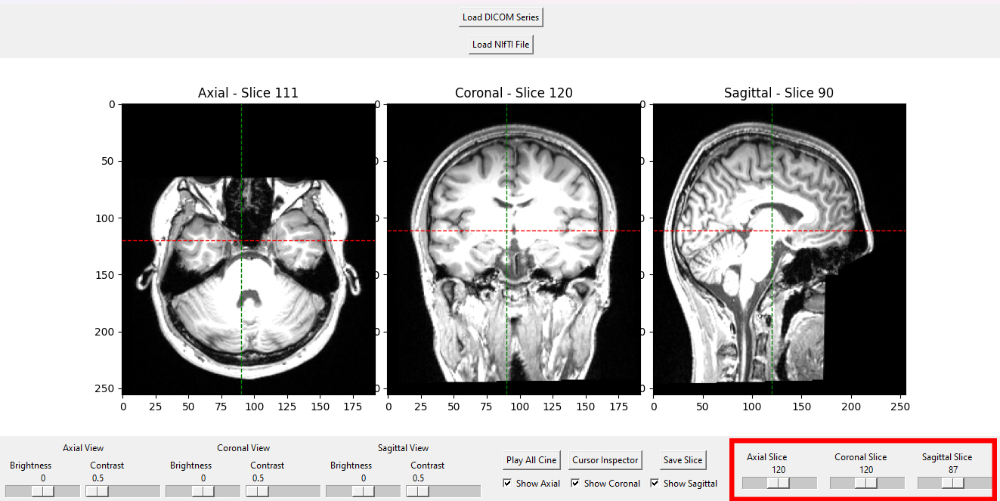
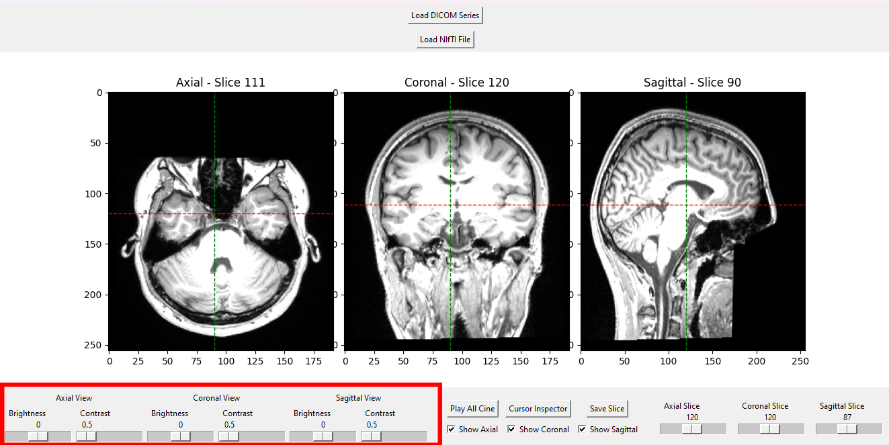
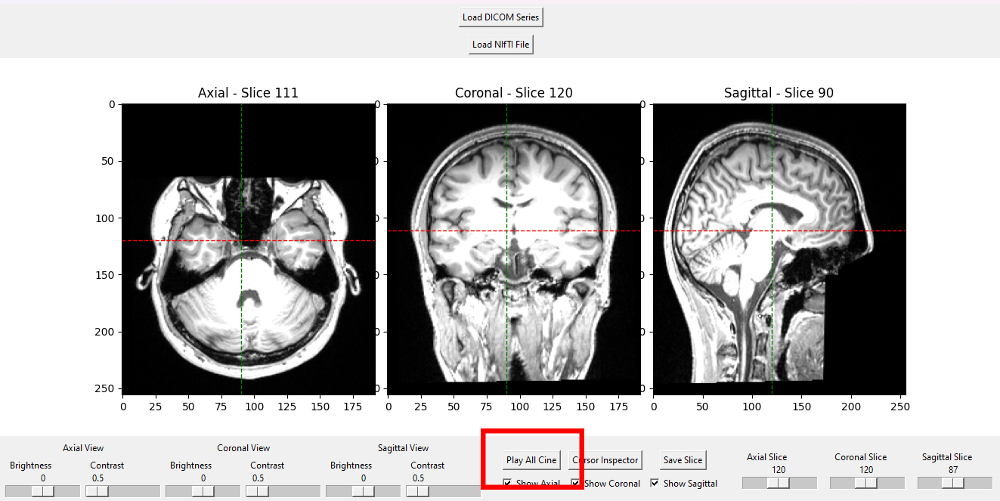
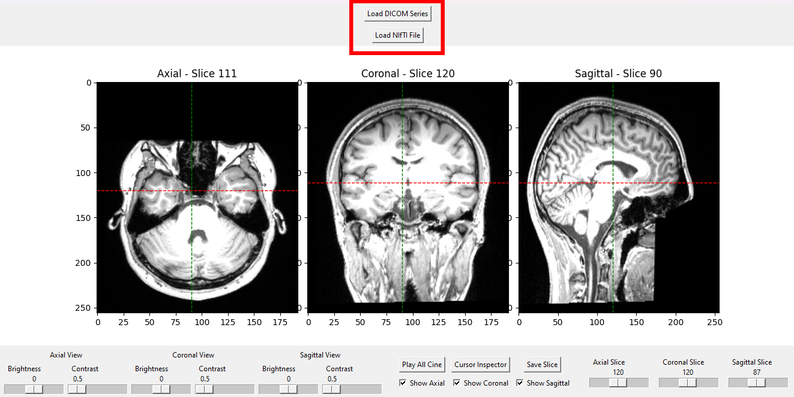
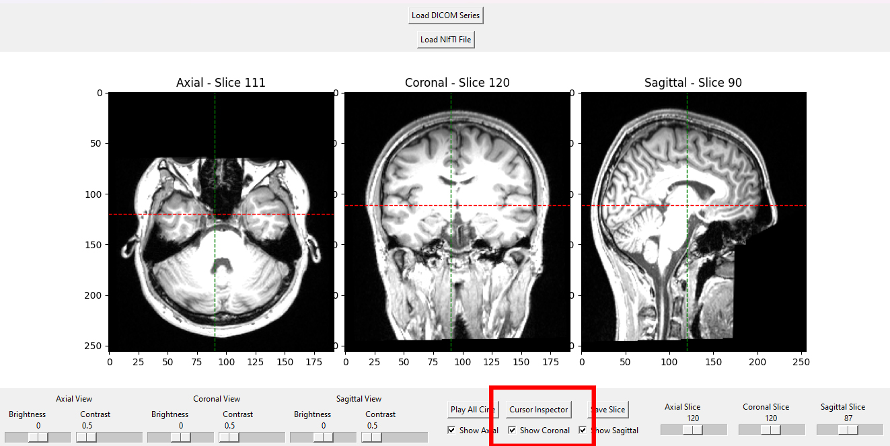

# MPR Viewer

## Overview
This project is an **Enhanced Multi-Planar Reconstruction (MPR) Viewer**, inspired by ITK-Snap, for visualizing medical imaging data. The application supports viewing slices in axial, sagittal, and coronal planes, with interactive features like scrolling, zooming, cine playback, and crosshair navigation.

## Features
- **Load Medical Images**: Supports loading DICOM series and NIfTI files.
- **Interactive Views**:
  - Axial, sagittal, and coronal planes.
  - Slice scrolling and cine playback.
  - Crosshair for synchronized navigation.
  - Zoom in/out and adjust brightness/contrast with mouse controls.
- **Customizable Interface**:
  - Enable/disable crosshair navigation.
  - Pause/play cine mode.
- **Simple GUI**: Built with `Tkinter` and `Matplotlib`.

## Installation
1. Clone this repository:
   ```bash
   git clone https://github.com/your-repo/mpr-viewer.git
   cd mpr-viewer
   ```

2. Install dependencies:
   ```bash
   pip install -r requirements.txt
   ```

3. Run the application:
   ```bash
   python mpr_viewer.py
   ```

## How to Use
1. Start the application by running the script.
2. **Load an Image**:
   - Use the "Load DICOM Series" button to select a folder containing DICOM files.
   - Use the "Load NIfTI File" button to select a `.nii` or `.nii.gz` file.
3. **Explore the Views**:
   - Scroll through slices using the mouse wheel or scroll bar.
   - Adjust zoom and brightness/contrast using the mouse.
   - Use the crosshair for synchronized navigation.
   - Enable/disable cine mode for automatic slice playback.
4. **Adjust Settings**:
   - Enable or disable the crosshair feature using the checkbox.
   - Control cine playback speed using the controls.

## File Structure
```
mpr-viewer/
│
├── mpr_viewer.py       # Main application script
├── requirements.txt    # Python dependencies
└── README.md           # Documentation
```

## Screenshots
- **Slider for each view to choose which photo to be shown**

- **You can adjust brightness and contrast for each view**

- **Play and pause cine**

- **Accepts both NIFTI and DICOM files**

- **Crosshair feature to indicate the selected point in the other views**



## Future Improvements
- 3D volume rendering support.
- Advanced tools for segmentation and annotation.
- Save and export visualization settings.

## Credits
- **ITK-Snap** for inspiring the UI and functionality.
- Built with `SimpleITK`, `Matplotlib`, and `Tkinter`.

